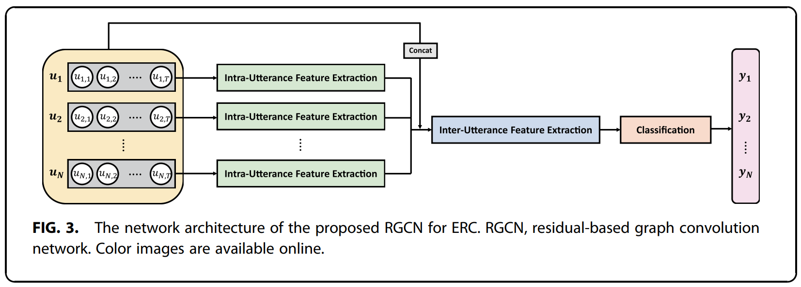
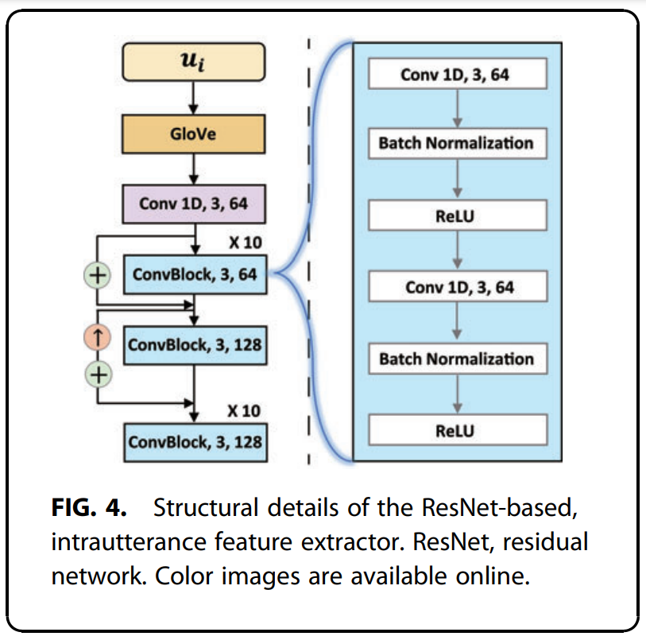
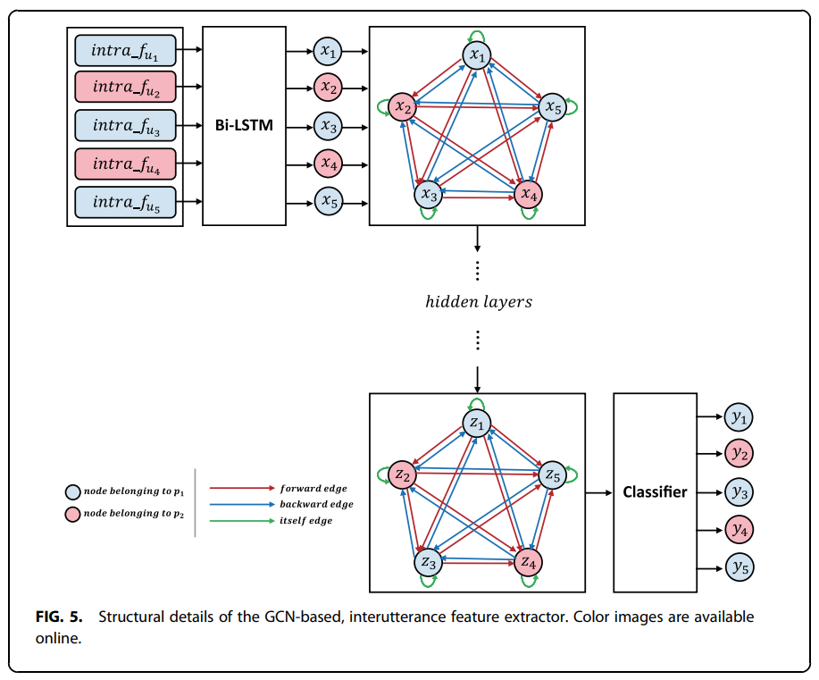
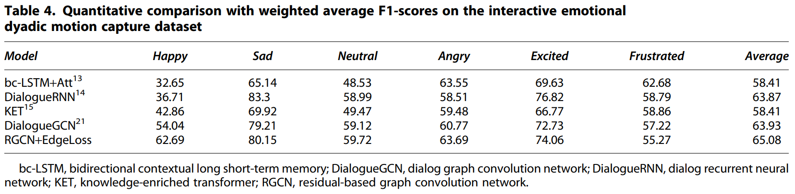
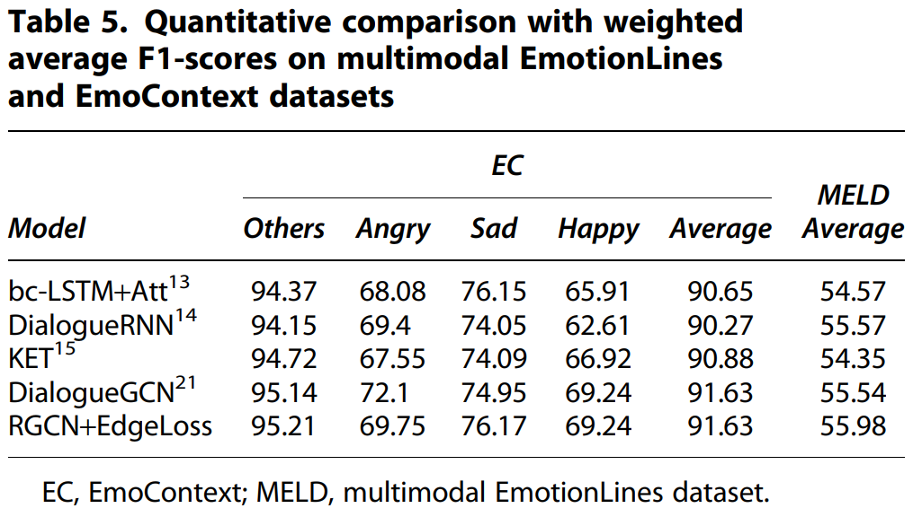

# Residual-Based Graph Convolutional Network for Emotion Recognition in Conversation for Smart Internet of Things
#### Young-Ju Choi, Young-Woon Lee, and Byung-Gyu Kim
#### Intelligent Vision Processing Lab. (IVPL), Sookmyung Women's University, Seoul, Republic of Korea
----------------------------
#### This repository is the official PyTorch implementation of the paper published in _Big Data, Mary Ann Liebert, Inc., publishers_.
[](https://www.liebertpub.com/doi/pdf/10.1089/big.2020.0274)

----------------------------
## Summary of paper
#### Abstract
> _Recently, emotion recognition in conversation (ERC) has become more crucial in the development of diverse Internet of Things devices, especially closely connected with users. The majority of deep learning-based methods for ERC combine the multilayer, bidirectional, recurrent feature extractor and the attention module to extract sequential features. In addition to this, the latest model utilizes speaker information and the relationship between utterances through the graph network. However, before the input is fed into the bidirectional recurrent module, detailed intrautterance features should be obtained without variation of characteristics. In this article, we propose a residual-based graph convolution network (RGCN) and a new loss function. Our RGCN contains the residual network (ResNet)-based, intrautterance feature extractor and the GCN-based, interutterance feature extractor to fully exploit the intra–inter informative features. In the intrautterance feature extractor based on ResNet, the elaborate context feature for each independent utterance can be produced. Then, the condensed feature can be obtained through an additional GCN-based, interutterance feature extractor with the neighboring associated features for a conversation. The proposed loss function reflects the edge weight to improve effectiveness. Experimental results demonstrate that the proposed method achieves superior performance compared with state-of-the-art methods._
>

#### Network Architecture
<p align="center">
  
</p>

<p align="center">
  
</p>

<p align="center">
  
</p>

#### Experimental Results
<p align="center">
  
</p>

<p align="center">
  
</p>

----------------------------
## Getting Started
#### Dependencies and Installation
- Anaconda3
- Python == 3.6
    ```bash
    conda create --name rgcn python=3.6
    ```
- [PyTorch](https://pytorch.org/) (NVIDIA GPU + [CUDA](https://developer.nvidia.com/cuda-downloads))
    
    Trained on PyTorch 1.0.0 CUDA 10.0
    ```bash
    conda install pytorch==1.0.0 torchvision==0.2.1 cuda100 -c pytorch
    conda install cudatoolkit=10.0 -c pytorch
    ```
    
- torch-geometric, torch-sparse, torch-scatter, torch-cluster
    ```bash
    pip install torch-geometric==1.1.0
    pip install torch-sparse==0.2.4
    pip install torch-scatter==1.1.2
    pip install torch-cluster==1.2.4
    ```
- pickle, pandas, scikit-learn, spacy, torchtext
    ```bash
    pip install pickle-mixin
    pip install pandas
    pip install scikit-learn
    pip install spacy
    pip install torchtext
    ```

#### Dataset Preparation
We used the interactive emotional dyadic motion capture (IEMOCAP), MELD, EmoContext (EC) datasets.

```bash
[IEMOCAP] Busso, Carlos, et al. "IEMOCAP: Interactive emotional dyadic motion capture database." Language resources and evaluation 42.4 (2008): 335-359.
[MELD] Poria, Soujanya, et al. "Meld: A multimodal multi-party dataset for emotion recognition in conversations." arXiv preprint arXiv:1810.02508 (2018).
[EC] Chatterjee, Ankush, et al. "Semeval-2019 task 3: Emocontext contextual emotion detection in text." Proceedings of the 13th international workshop on semantic evaluation. 2019.
```

- Download

    You can download three datasets in below link.

    [](https://drive.google.com/drive/folders/1y2ZnvTmVpv6UFX3RykePmoUWJeIFJpm4?usp=sharing)
    
    Put the datasets in ./datasets/


#### Model Zoo
Pre-trained models are available in below link.

[](https://drive.google.com/drive/folders/1y2ZnvTmVpv6UFX3RykePmoUWJeIFJpm4?usp=sharing)

Also, we used the '300-dimensional pretrained 840B GloVe' (glove.840B.300d) for embedding and you can download the glove.840B.300d in [here](https://nlp.stanford.edu/projects/glove/).


----------------------------
## Training
Run in ./codes/

- IEMOCAP

    ```bash
    python train_RGCN_IEMOCAP.py
    ```

- MELD

    ```bash
    python train_RGCN_MELD.py
    ```
    
- EC

    ```bash
    python train_RGCN_EC.py
    ```

----------------------------
## Prediction
Run in ./codes/

- IEMOCAP

    ```bash
    python predict_RGCN_IEMOCAP.py
    ```

- MELD

    ```bash
    python predict_RGCN_MELD.py
    ```
    
- EC

    ```bash
    python predict_RGCN_EC.py
    ```
    
----------------------------
## Citation
    @article{choi2021residual,
        title={Residual-based graph convolutional network for emotion recognition in conversation for smart Internet of Things},
        author={Choi, Young-Ju and Lee, Young-Woon and Kim, Byung-Gyu},
        journal={Big Data},
        volume={9},
        number={4},
        pages={279--288},
        year={2021},
        publisher={Mary Ann Liebert, Inc., publishers 140 Huguenot Street, 3rd Floor New~…}
    }
    
----------------------------
## Acknowledgement
The codes are heavily based on [DialogueGCN](https://github.com/declare-lab/conv-emotion). Thanks for their awesome works.

```bash
DialogueGCN: A Graph Convolutional Neural Network for Emotion Recognition in Conversation. D. Ghosal, N. Majumder, S. Poria, N. Chhaya, & A. Gelbukh. EMNLP-IJCNLP (2019), Hong Kong, China.
```
